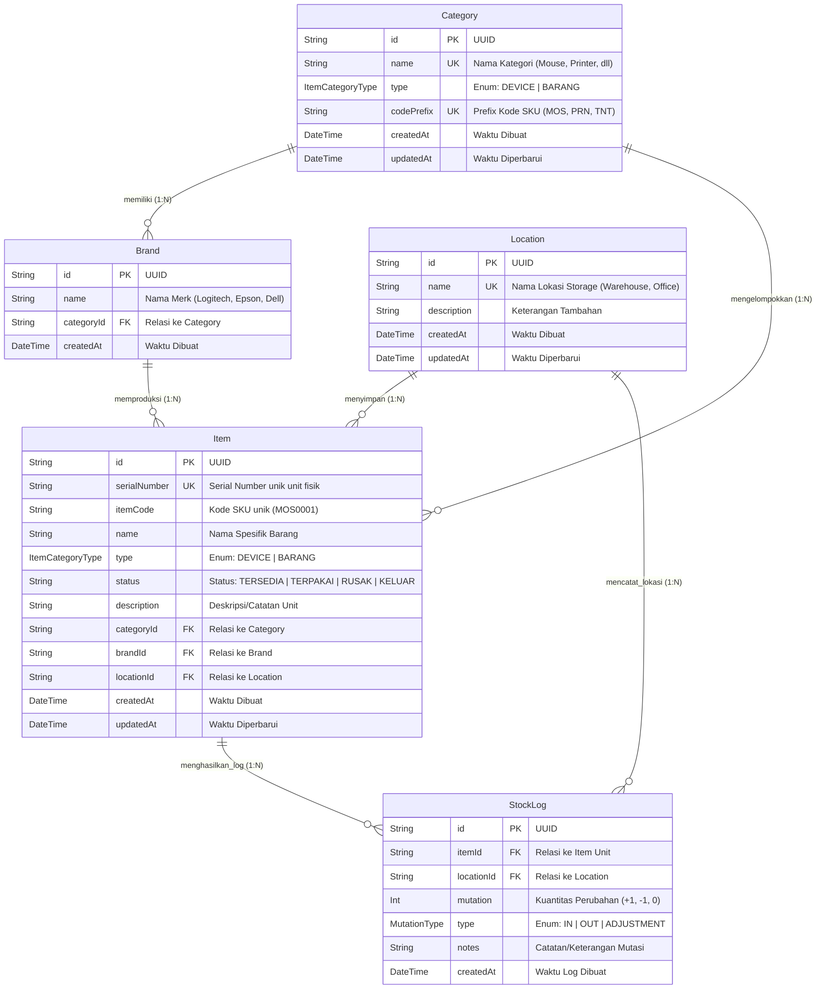

# 📦 IT Warehouse Management & Stock Taking System

Sistem Manajemen Inventaris, Stock Opname, dan Tracking Unit **Serial Number (SN)** Gudang IT berbasis localhost. Sistem ini dirancang untuk mengelola inventaris perangkat IT (*Devices*) dan bahan habis pakai (*Consumables/Barang*), otomatisasi penomoran kode SKU unik, pemantauan unit individual via Serial Number, serta pencatatan mutasi stok secara *real-time* berbasis **Audit Trail**.

---

## 🛠️ Tech Stack (Teknologi yang Digunakan)

Sistem ini dibangun menggunakan arsitektur modern Next.js App Router full-stack TypeScript dengan komposit teknologi berikut:

| Layer | Teknologi | Peran & Deskripsi |
| :--- | :--- | :--- |
| **Framework** | **Next.js 14+** (App Router) | Framework React Full-Stack dengan Server Actions & Server Components untuk performa tinggi tanpa REST API terpisah. |
| **Bahasa Pemrograman** | **TypeScript 5.6** | Pengetikan statis (*static typing*) pada seluruh lapisan kode client & server untuk mencegah runtime error. |
| **UI Components & Styling** | **Tailwind CSS v3** & **Lucide React** | Utility-first CSS framework untuk styling responsif & modern visual icon system. |
| **Forms & Validasi** | **React Hook Form v7** & **Zod v3** | Manajemen state formulir ringan dengan validasi skema tipe data ketat pada modal input. |
| **Database** | **SQLite** (`dev.db`) | Database relasional lokal zero-config yang ringan dan cepat untuk deployment localhost. |
| **ORM Layer** | **Prisma ORM v6.2** | Type-safe ORM untuk migrasi skema database, pemutakhiran relasi data, dan *seed data*. |
| **State & Cache Invalidation** | **Next.js `revalidatePath`** | Sinkronisasi data real-time dan pembaruan cache otomatis pada seluruh halaman setelah aksi server (*mutations*). |

---

## 📌 Use Case Diagram

Diagram Use Case berikut menggambarkan seluruh interaksi **IT Warehouse Admin / Staff** dengan fitur-fitur utama di dalam sistem:

```mermaid
graph TD
    User(("👤 IT Warehouse Admin / Staff"))

    subgraph Modul_Dashboard ["1. Dashboard Analytics Center"]
        UC1["Melihat Ringkasan Statistik Inventaris"]
        UC2["Melihat Recent Stock Activity & Item Terdaftar"]
    end

    subgraph Modul_Inventaris ["2. Manajemen Inventaris & Unit Serial Number"]
        UC3["Melihat Grouped Stock & Detail Unit SN"]
        UC4["Mencari & Memfilter Inventaris"]
        UC5["Pendaftaran Unit SN Baru (Single & Bulk Entry)"]
        UC6["Otomatisasi Penomoran Kode SKU"]
        UC7["Edit Informasi Detail Unit SN"]
        UC8["Mutasi Lokasi Storage Unit"]
        UC9["Update Status Unit (TERSEDIA/TERPAKAI/RUSAK/KELUAR)"]
        UC10["Hapus Unit SN & Hapus Log Terkait"]
    end

    subgraph Modul_MasterData ["3. Manajemen Master Data"]
        UC11["Kelola Master Kategori (Device / Barang & SKU Prefix)"]
        UC12["Kelola Master Merk / Brand (Terikat Kategori & Inline Form)"]
        UC13["Kelola Master Lokasi Storage (Warehouse, Office, Server Room)"]
    end

    subgraph Modul_AuditLog ["4. Audit Trail & Mutasi Stok"]
        UC14["Melihat Complete History Log Mutasi Stok"]
        UC15["Memfilter Log Mutasi (Berdasarkan Lokasi, Tipe IN/OUT/ADJUSTMENT)"]
    end

    User --> UC1
    User --> UC2
    User --> UC3
    User --> UC4
    User --> UC5
    User --> UC7
    User --> UC8
    User --> UC9
    User --> UC10
    User --> UC11
    User --> UC12
    User --> UC13
    User --> UC14
    User --> UC15

    UC5 ..> UC6 : "<<include>>"
```

### Deskripsi Ringkas Use Case Per Modul:

1. **Dashboard Analytics Center**:
   - **Melihat Ringkasan Statistik**: Menampilkan metrik total unit SN, total perangkat Device, total bahan habis pakai (Consumables/Barang), stok tersedia, dan unit rusak.
   - **Recent Activity Log**: Memantau daftar aktivitas transaksi stok dan barang baru yang terdaftar secara real-time.

2. **Manajemen Inventaris & Unit Serial Number (SN)**:
   - **Grouped Stock View**: Mengelompokkan barang berdasarkan nama, kategori, brand, dan lokasi dengan opsi rincian unit Serial Number (SN).
   - **Pendaftaran Bulk SN**: Memungkinkan pendaftaran sekaligus banyak unit SN via pemisah koma atau baris baru (*newline*).
   - **Auto SKU Generator**: Otomatis membuat kode SKU format `[PREFIX][4_DIGIT]` sesuai kategori yang dipilih.
   - **Mutasi Lokasi Storage**: Memindahkan unit dari satu pos lokasi ke pos lokasi lain disertai catatan audit.
   - **Update Status Unit**: Mengubah status fisik unit (`TERSEDIA`, `TERPAKAI`, `RUSAK`, `KELUAR`) yang berdampak langsung pada kalkulasi stok & audit log.

3. **Manajemen Master Data**:
   - **Master Kategori**: Pengelolaan jenis barang dengan atribusi `type` (`DEVICE` vs `BARANG`) dan inisial `codePrefix`.
   - **Master Brand**: Pengelolaan merk barang yang difilter secara fleksibel sesuai kategori terkait (*dependent dropdown*).
   - **Master Lokasi Storage**: Pengelolaan pos area penyimpan (*Warehouse IT*, *Main Office*, *Server Room*, dll).

4. **Audit Trail & Log Mutasi**:
   - **Immutable Log Record**: Pencatatan riwayat transaksi penambahan (`IN`), pengurangan (`OUT`), dan penyesuaian lokasi/status (`ADJUSTMENT`).

---

## 🗄️ Entity Relationship Diagram (ERD)

Berikut adalah diagram keterhubungan antar entitas (**ERD**) yang digunakan dalam skema database sistem:



### Rincian Relasi & Integritas Entitas:

- **`Category` ➔ `Brand`**: Relasi 1-to-N (*Cascade Delete*). Satu kategori memiliki banyak pilihan merk.
- **`Category` ➔ `Item`**: Relasi 1-to-N. Menentukan tipe aset (`DEVICE`/`BARANG`) dan prefix SKU dari unit barang.
- **`Brand` ➔ `Item`**: Relasi 1-to-N. Menghubungkan unit barang ke merk terdaftar.
- **`Location` ➔ `Item`**: Relasi 1-to-N. Menentukan posisi storage fisik tempat unit disimpan.
- **`Item` ➔ `StockLog`**: Relasi 1-to-N (*Cascade Delete*). Setiap perubahan lokasi, penambahan, atau status unit menghasilkan rekaman histori di audit trail.
- **`Location` ➔ `StockLog`**: Relasi 1-to-N. Menandai lokasi terkait pada saat transaksi mutasi dilakukan.

---

## 🚀 Panduan Setup & Instalasi

### 1. Prasyarat Sistem
- **Node.js**: v18.0.0 atau yang lebih baru (Disarankan Node.js v20/v22 LTS)
- **NPM**: v9.0.0 atau yang lebih baru

### 2. Langkah Instalasi

1. **Clone repository & masuk ke direktori proyek**:
   ```bash
   git clone <URL_REPOSITORY_ANDA>
   cd stock-management-it-warehouse
   ```

2. **Install seluruh dependensi proyek**:
   ```bash
   npm install
   ```

3. **Konfigurasi Environment**:
   Pastikan file `.env` sudah tersedia di root proyek dengan konfigurasi SQLite:
   ```env
   DATABASE_URL="file:./dev.db"
   ```

4. **Inisialisasi Database SQLite & Tipe Prisma Client**:
   ```bash
   # Generasi Prisma Client
   npm run prisma:generate

   # Buat tabel dan skema database SQLite lokal
   npm run prisma:push
   ```

5. **Isi Data Awal / Seed Demo Data**:
   ```bash
   npm run prisma:seed
   ```
   *Perintah ini akan memasukkan data awal Kategori (Mouse, Keyboard, Printer, Tinta, Kabel), Merk (Logitech, Epson, Belden), Lokasi Storage, serta beberapa sampel unit fisik lengkap dengan Serial Number dan Log Mutasi awal.*

---

## 🖥️ Cara Menjalankan Aplikasi

### Mode Pengembangan (Development)

Jalankan perintah berikut di terminal:
```bash
npm run dev
```

Buka browser Anda dan akses aplikasi di:
👉 **[http://localhost:3000](http://localhost:3000)**

---

### Mode Produksi (Production Build)

Untuk membuat build produksi dan menjalankannya:
```bash
# 1. Build aplikasi
npm run build

# 2. Jalankan server produksi
npm run start
```

---

## 📂 Struktur Direktori Proyek

```text
├── .agent/               # Spesifikasi desain & konteks produk (DESIGN.md, PRODUCT_CONTEXT.md, dll)
├── prisma/
│   ├── schema.prisma     # Skema Prisma (Category, Brand, Location, Item, StockLog)
│   ├── seed.ts           # Script seeding data demo awal (Unit SN & Master Data)
│   └── dev.db            # Database SQLite lokal (otomatis dibuat & diabaikan oleh git)
├── src/
│   ├── app/
│   │   ├── actions/      # Server Actions Next.js (items.ts, master-data.ts, logs.ts)
│   │   ├── items/        # Halaman Inventaris, Management Unit SN & Opname
│   │   ├── categories/   # Halaman Master Kategori & Prefix SKU
│   │   ├── brands/       # Halaman Master Merk / Brand
│   │   ├── locations/    # Halaman Master Lokasi Storage
│   │   ├── logs/         # Halaman Complete Audit Trail Mutasi Stok
│   │   ├── globals.css   # Theme & styling Tailwind global
│   │   ├── layout.tsx    # Root Layout (Sidebar Navigation + Header)
│   │   └── page.tsx      # Dashboard Utama & Analytics Center
│   ├── components/       # Component UI (Item Modal, Status Modal, Mutasi Modal, Master Data Form)
│   └── lib/
│       ├── db.ts         # Singleton client instance Prisma Client
│       └── sku.ts        # Helper logika generator otomatisasi SKU
├── .env                  # File environment konfigurasi database
├── .gitignore            # Pengabaian secrets & build artifacts
├── package.json          # Dependency & script npm
└── README.md             # Dokumentasi panduan proyek
```

---

## 📊 Perintah Utility Database & Scripts

| Command | Keterangan |
| :--- | :--- |
| `npm run dev` | Menjalankan Next.js dev server pada `http://localhost:3000` |
| `npm run prisma:generate` | Memperbarui tipe Prisma Client setelah perubahan skema |
| `npm run prisma:push` | Menyinkronkan `schema.prisma` ke database SQLite (`dev.db`) |
| `npm run prisma:seed` | Mengisi data master awal dan unit sampel Serial Number |
| `npx prisma studio` | Membuka GUI database browser di `http://localhost:5555` |
| `npx prisma db push --force-reset` | Melakukan reset total database SQLite jika skema rusak |

---

## ⚠️ Troubleshooting & FAQ

### 1. Error `PrismaClientValidationError` atau Schema Out of Sync
Jika saat menjalankan aplikasi mengalami error Prisma Client, pastikan untuk menggenerate ulang client dan menyinkronkan database:
```bash
npm run prisma:generate
npm run prisma:push
```

### 2. Memperbaiki Serial Number Duplikat
Sistem menerapkan batasan **Unique** pada `serialNumber`. Jika menambahkan unit baru dengan Serial Number yang sudah ada di database, sistem akan menolak dan memberikan pesan peringatan detail Serial Number yang berbenturan.

### 3. Reset Database & Re-Seed
Jika ingin menghapus seluruh data percobaan dan kembali ke data awal:
```bash
npx prisma db push --force-reset
npm run prisma:seed
```

### 4. Nilai Enum Case-Sensitive
Enum `ItemCategoryType` (`DEVICE`, `BARANG`) dan `MutationType` (`IN`, `OUT`, `ADJUSTMENT`) pada skema Prisma bersifat **Strict Case-Sensitive (Huruf Kapital)**.
